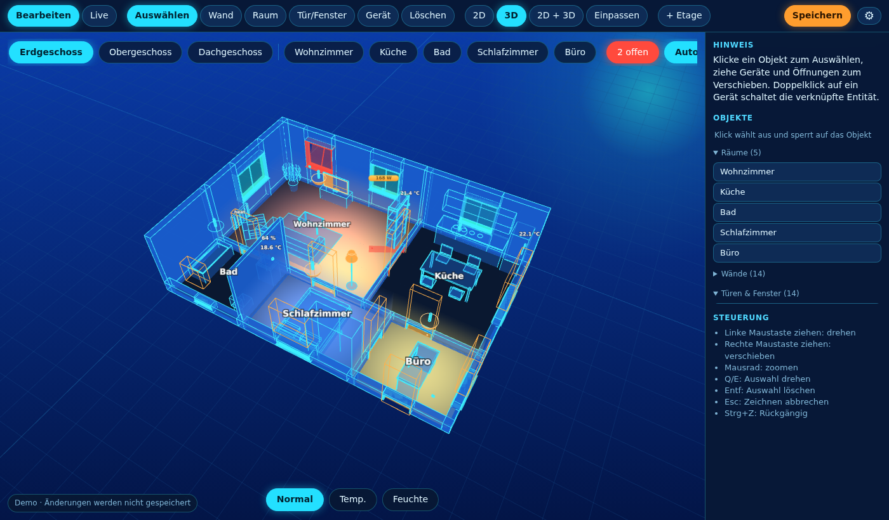
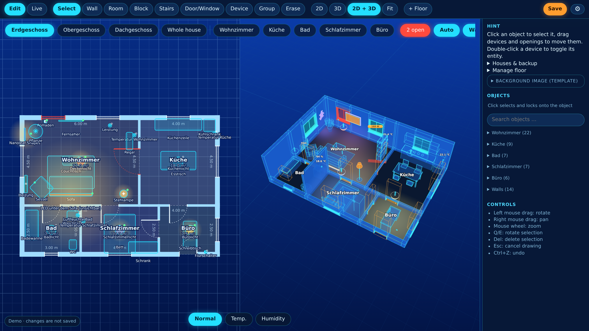
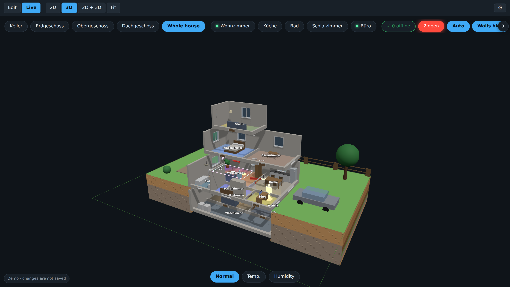
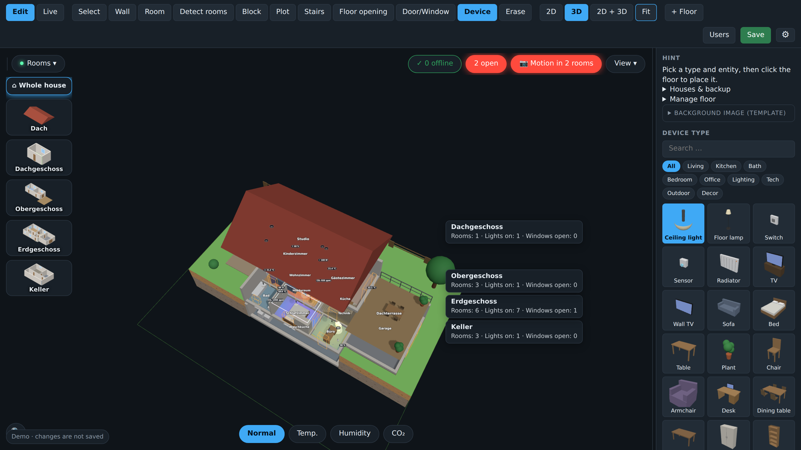
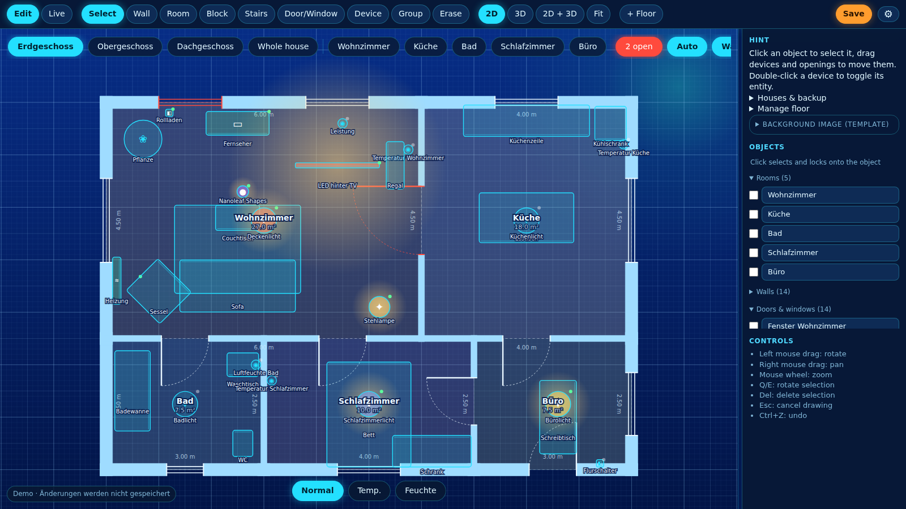
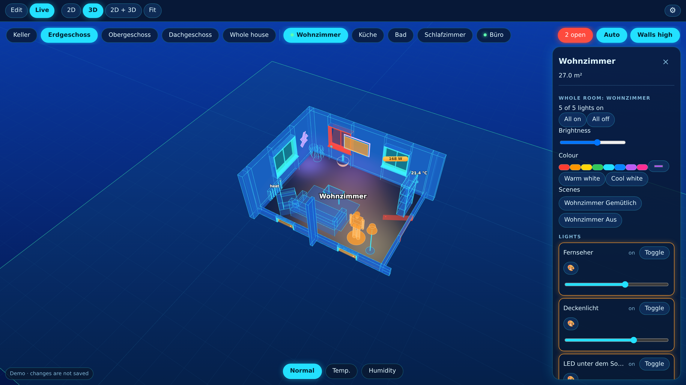
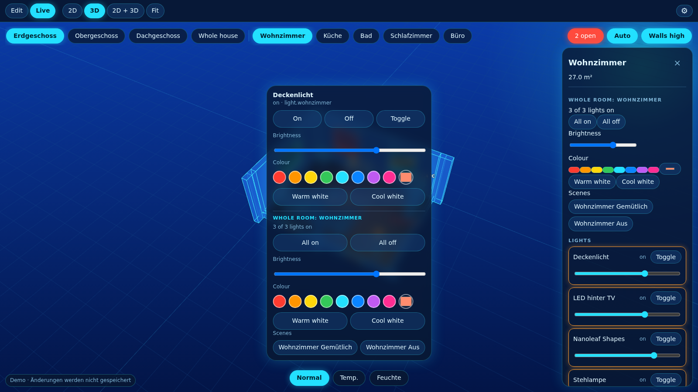

<div align="center">

# 🏠 3D Floorplan for Home Assistant

### Draw your home, see it in 3D and control it right where things are.

[](https://github.com/BuRnEd4AiM/HA-Floorplanner/actions/workflows/ci.yml)
[](https://github.com/BuRnEd4AiM/HA-Floorplanner/releases)
[](LICENSE)


[](https://my.home-assistant.io/redirect/supervisor_add_addon_repository/?repository_url=https%3A%2F%2Fgithub.com%2FBuRnEd4AiM%2FHA-Floorplanner)



*Your own floor plan as a glowing 3D hologram, live with your real lights, sensors, windows and scenes.*

**[Features](#-features) · [Installation](#-installation) · [Quick start](#-quick-start) · [Tablets](#-wall-tablets--kiosk) · [Documentation](#-documentation) · [Roadmap](ROADMAP.md)**

</div>

---

## ✨ Why this add-on?

Most floor plan cards make you place icons on a picture. **3D Floorplan** lets you *build* your home: walls, rooms, doors, windows, stairs and furniture, then see it as a real 3D model in which every device is bound to a Home Assistant entity. Tap a lamp where it stands, switch a whole room, start a scene, see which window is open, all in one place, on your phone, your desktop or a wall tablet.

It is made with a lot of love for my own smart home, and it is used every day. I hope it makes yours a little nicer, too. 💙

## 🤖 About this project (honest note)

This is an **AI-assisted project**: the code is written together with an AI (Claude by Anthropic). The idea, the design, every feature request, the decisions and the testing in my own smart home come from me, and a lot of time and care went into it: hundreds of iterations, screenshots, bug reports and fixes, tested on real wall tablets. The AI is my pair programmer, not an autopilot.

What that means for you: the code is automatically tested (backend and browser tests run on every change), everything is open source under the MIT license, and you are welcome to read, question and improve it. If you find a bug, please open an issue, I take it seriously and will fix it.

## 🎯 Features

### 🏗️ Build your home

| | |
| --- | --- |
| **Walls, rooms and floors** | Draw on a snapping grid in a 2D blueprint editor that is linked live with the 3D view (split view). Several floors, basement and roof, placeholder blocks for floors you do not draw |
| **Trace your plan** | Load a scan or photo of your floor plan as a template, calibrate its scale and trace over it |
| **Stairs** | Straight, L-shaped, U-shaped and spiral stairs with real floor openings |
| **Doors and windows** | 12 presets: front door, glass door, double door, sliding door, single / double / triple window, balcony door, fixed glazing ... they cut real openings into the wall and open when the contact sensor reports *open* |
| **Garden and surroundings** | Trees, bushes, lawn, terrace, pool, paths, fences and cars around the house, in natural colours |
| **Whole-house view** | See all floors, basement and roof stacked as one building |
| **Clear object list** | Everything grouped by room (the room, its doors / windows and furniture), with a search field; the side panel can be dragged wider |
| **Several houses** | One floor plan per house (yours, your parents', a holiday home ...), a house selector and `?house=` links for kiosks |

<table>
<tr>
<td width="50%"><br><sub><b>2D + 3D split view</b>: draw in the blueprint, see it in 3D instantly</sub></td>
<td width="50%"><br><sub><b>Whole-house view</b>: all floors stacked</sub></td>
</tr>
</table>

### 🪑 Furnish it

- **Furniture library with previews**, search and categories (Living, Kitchen, Bath, Bedroom, Office, Lighting, Tech, Outdoor, Decor). The search understands everyday names ("Fernseher", "Couch" ...)
- **75+ built-in pieces**: sofas, beds, kitchens, bathroom, lamps, TVs (also wall-mounted), radiators, cameras, robot vacuum and more
- **Your own 3D models**: upload any `.glb` file
- **Pictures on walls**: upload a PNG / JPG / WebP and hang it, it clicks flat onto the nearest wall
- **Exact sizes**: enter width, height and depth in metres, or drag the handles in the 2D plan. Tilt, roll and mirror pieces freely
- **Groups**: combine pieces (e.g. a Nanoleaf logo) so they move, turn and mirror as one shape
- **Wall stop**: furniture cannot be pushed through walls, it slides along them instead (can be switched off)
- **Lock**: a checkbox before every item keeps it from being moved by accident

<table>
<tr>
<td width="50%"><br><sub><b>Furniture library</b> with previews, search and categories</sub></td>
<td width="50%"><br><sub><b>2D blueprint editor</b> with snapping, dimensions and live state colours</sub></td>
</tr>
</table>

### 💡 Control it

- **Every device is a Home Assistant entity**: tap a lamp to switch it, dim it, pick a colour or warm / cool white
- **Whole room at once**: all lights on / off, brightness and colour for the entire room, plus the room's scenes, in one panel
- **Scenes where the light is**: the popup of a light lists every scene that contains it (e.g. *Gaming*)
- **Effects**: effect lists of Nanoleaf, WLED, Hue and others; **Nanoleaf panel shapes** (triangle, hexagon, square, bar) for building your layout
- **Realistic light**: lights glow in their real colour, with type-dependent light pools (a strip does not light the room like a ceiling lamp), dimmable
- **Open windows and doors**: windows tilt open in 3D, **each pane of a double or triple window can have its own sensor**, an *n open* pill shows the overall state
- **Heat and humidity views**: rooms are coloured by temperature or humidity
- **Home Assistant areas**: entities are grouped by your areas and assigned automatically

<table>
<tr>
<td width="50%"><br><sub><b>Whole-room control</b>: lights, colour, brightness and scenes</sub></td>
<td width="50%"><br><sub><b>Light popup</b>: tap a lamp right where it stands</sub></td>
</tr>
</table>

### 🔒 Safe, private and dependable

- **Permissions**: only chosen users edit, everyone else gets a read-only live view, enforced in the backend
- **Offline and private**: three.js is bundled, no CDN, no cloud, no account; it opens through Ingress in the Home Assistant sidebar
- **Backup and restore**: one file with all houses, settings, pictures and models. A safety copy is made before every restore
- **Undo**: `Ctrl+Z` for everything you draw
- **Your data stays yours**: layouts live in the add-on's `/data` folder and survive updates

### 📱 Wall tablets / kiosk

- One Home Assistant user per tablet: it starts in **its own room** and sees only the views you allow
- **Low-power mode** for Fire tablets and other weak devices (automatic in kiosk mode): lower resolution, throttled animation, no shadows
- Open a specific house with `?house=Parents`

### 🎨 Look

Hologram, dark and light theme, metric or imperial units, German and English UI.

## 📦 Installation

1. In Home Assistant open **Settings → Apps → App store → ⋮ → Repositories**.
2. Add `https://github.com/BuRnEd4AiM/HA-Floorplanner` (or press the button at the top).
3. Reload the store, open **3D Floorplan**, **Install**, **Start** and enable **Show in sidebar**.

Requires Home Assistant OS or Supervised (anything with the Add-on / App store). Details on permissions and tablet setup are in the [documentation](floorplan3d/DOCS.md).

## 🚀 Quick start

| Action | How |
| --- | --- |
| Draw walls / rooms | Tool **Wall** `W` / **Room** `R`: click point by point, double-click or `Esc` finishes |
| Add doors and windows | Tool **Door/Window** `O`, pick a preset, click a wall |
| Place furniture | Tool **Device** `D`, pick a piece from the library, click the floor |
| Link an entity | Select a device, search the entity in the side panel |
| Resize | Drag the two square handles in the 2D plan, or type the size in metres |
| Move / rotate | Drag it, `Q` / `E` rotate in 15° steps |
| Lock an item | Tick the box before its name in the object list |
| Live mode | Tap a device to control it, tap a room for the whole room |
| Undo | `Ctrl+Z` |
| Backup | *Houses & backup* in the side panel |

## 🧪 Try it without Home Assistant

The demo is a single HTML file with an example house and simulated lights and sensors:

```bash
cd demo && npm install && npm run build      # → demo/dist/floorplan3d-demo.html
```

Open the file by double-click. Changes are not saved in the demo.

## 📚 Documentation

- [User guide](floorplan3d/DOCS.md): permissions, tablets and views, areas, whole-room control, Nanoleaf, 2D editor, houses, backup
- [Architecture](docs/ARCHITECTURE.md): how the add-on is built
- [Changelog](CHANGELOG.md) · [Roadmap](ROADMAP.md) · [Security policy](SECURITY.md)

## 🛠️ Development

```bash
pip install -r requirements-dev.txt
pytest -q                                                   # backend tests
DATA_DIR=./data python floorplan3d/rootfs/app/server.py     # http://localhost:8099 (standalone mode)
```

The browser end-to-end tests are described in [tests/e2e/README.md](tests/e2e/README.md). New to Git? Start with the [beginner guide (German)](docs/GIT-EINSTIEG.md). Every push to `main` that raises the version in `floorplan3d/config.yaml` creates a GitHub release automatically.

## 🤝 Contributing

Bug reports, ideas and pull requests are welcome, see [CONTRIBUTING.md](CONTRIBUTING.md) and the [issue templates](https://github.com/BuRnEd4AiM/HA-Floorplanner/issues/new/choose). Please follow the [Code of Conduct](CODE_OF_CONDUCT.md). If you like the project, a ⭐ on GitHub makes my day.

## 📄 License

[MIT](LICENSE) © 2026 BuRnEd4AiM. Bundles [three.js](https://threejs.org) (MIT).

<div align="center"><sub>Made with ❤️ for the Home Assistant community</sub></div>
