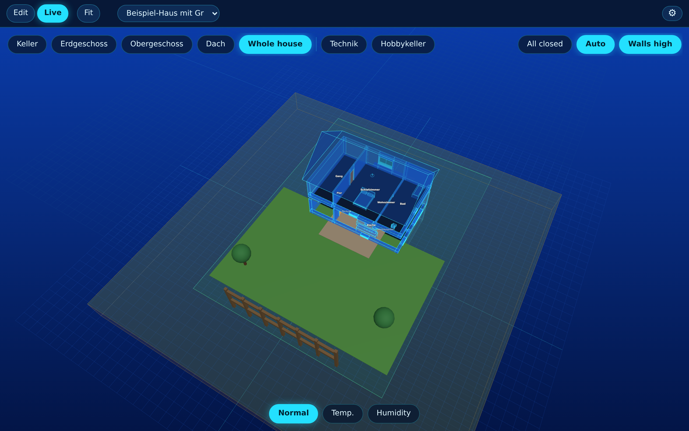
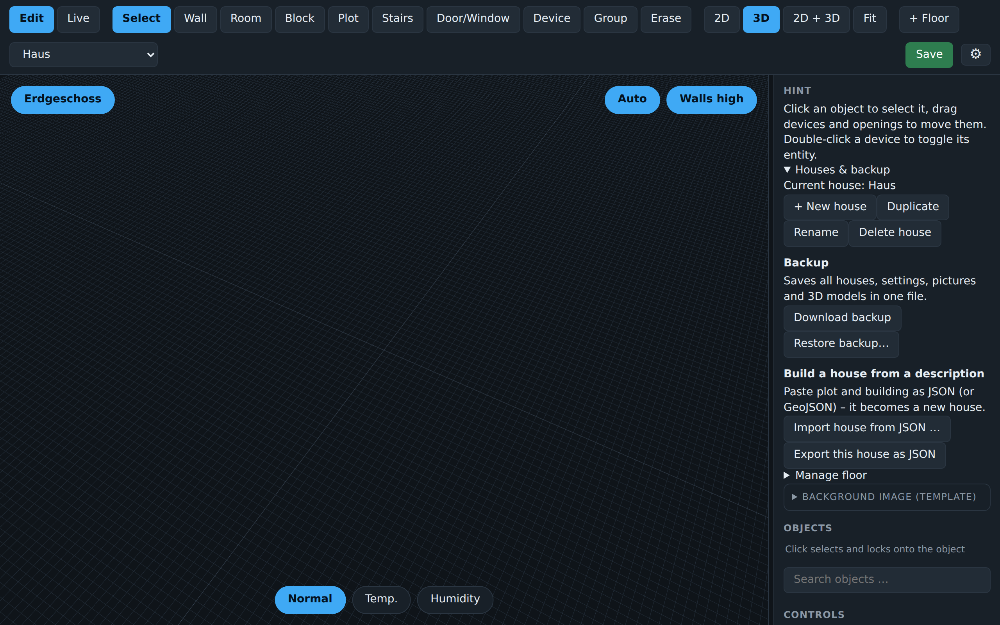
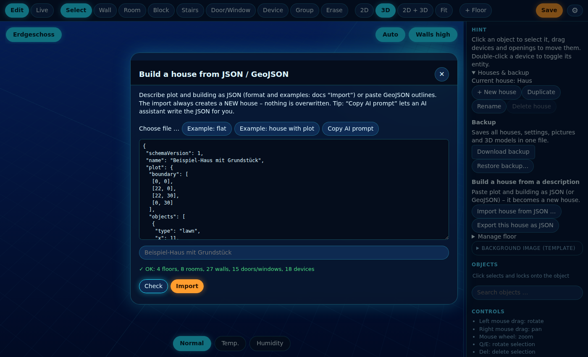
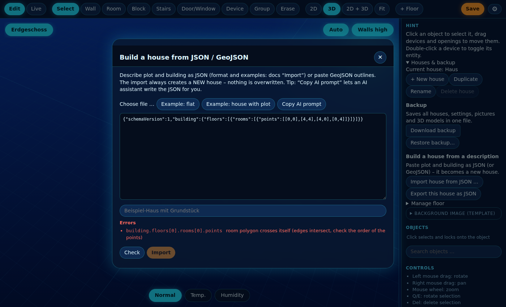
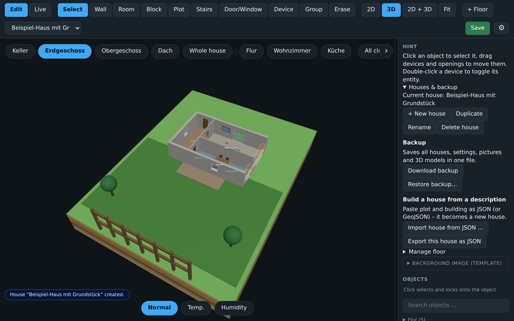
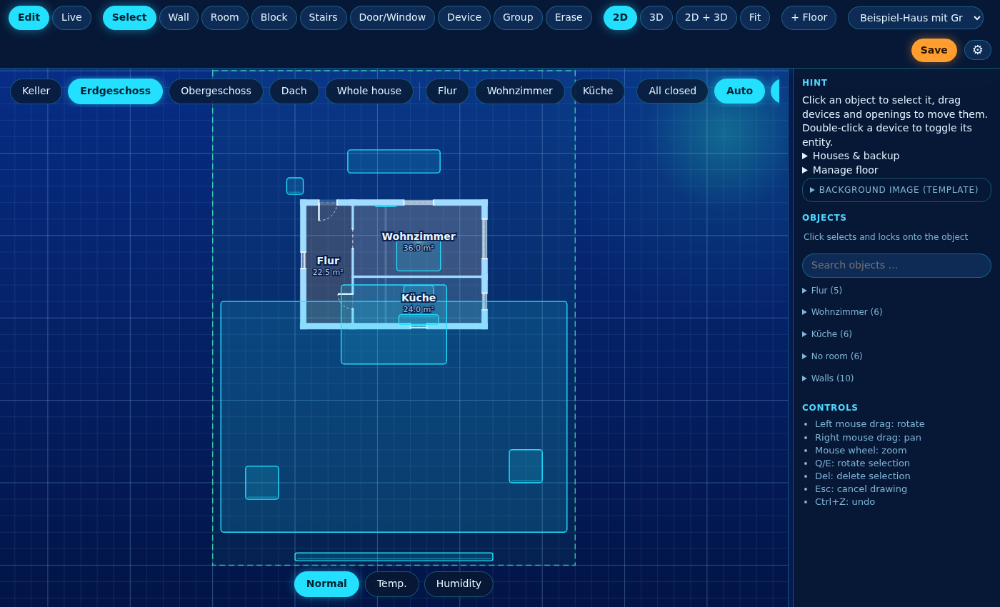

<div align="center">

# 📥 Import a house from JSON

**Describe plot, rooms, windows, doors and devices. The house builds itself.**



[Deutsch](IMPORT.md) · **English**

</div>

> [!NOTE]
> The import **always creates a new house** and never overwrites anything (max. 20 houses).

A small JSON description (plot, room polygons, windows, doors, devices) is turned into a complete **new house** in 3D Floorplan: walls, rooms, openings, floors, roof, plot boundary and garden.

You can write the JSON by hand, let an **AI** generate it, derive it from **GeoJSON** (cadastre / OpenStreetMap outlines) or **export** it from an existing house.

## Contents

[Quick start](#quick-start-in-30-seconds) · [Coordinates](#coordinates) · [Format](#format-schemaversion-1) · [API](#api) · [GeoJSON](#geojson) · [AI prompting](#ai-prompting) · [Export](#export-round-trip) · [Troubleshooting](#error-messages)

Ready-made examples: [`docs/examples/flat.json`](examples/flat.json) (flat, 1 floor) and [`docs/examples/house.json`](examples/house.json) (house with plot, basement, ground floor, upper floor, roof). The example rooms and floors have German names; names are just text and can be changed in the editor.

## Quick start in 30 seconds

**1. Open the import dialog.** In edit mode, expand **Houses & backup** in the side panel and click **Import house from JSON …**.



**2. Load an example and check it.** Click **Example: flat** or **Example: house with plot**, then **Check**. You get a summary (floors, rooms, walls, doors/windows, devices) and any warnings. **Import** only becomes active once exactly this text has been checked without errors.



**3. Read errors.** An error carries the exact path into your JSON (here: a room whose edges cross each other). Nothing is created while there are errors.



**4. Import.** The house is created as a **new house** and opened right away. Your existing house stays untouched; switch back any time with the house selector at the top.



**5. Whole house and plot.** In live mode, **Whole house** shows building, roof, plot and garden objects (lawn, terrace, trees, fence). The house stands in the lawn, the basement sits in the earth and is shown cut open on the camera side.


**6. Keep working in the 2D plan.** The plot boundary is dashed. From here on everything is a normal house: move walls, link devices to entities, add rooms.



## Coordinates

- Everything is in **metres**. `x` points east (right), `z` points south (down in the plan). `[0,0]` is the top left corner.
- Polygons: 3 to 100 points, any order, **must not cross themselves**.
- `building.origin: [x, z]` moves the building on the plot (plot boundary and garden objects stay where they are).

## Format (schemaVersion 1)

```jsonc
{
  "schemaVersion": 1,
  "name": "My house",
  "plot": {                                  // optional: the property
    "boundary": [[0,0],[22,0],[22,30],[0,30]],
    "objects": [{ "type": "tree", "x": 3, "z": 4 }]     // garden, terrace, pool, fence ...
  },
  "building": {
    "origin": [5.5, 8],                      // optional
    "wallHeight": 2.6, "outerWall": 0.3, "innerWall": 0.12,
    "footprint": [[0,0],[11,0],[11,9],[0,9]],           // optional: outline, gives thick outer walls
    "roof": { "type": "gable", "pitch": 38 },           // gable | hip | flat
    "floors": [
      {
        "name": "Ground floor", "kind": "floor",        // floor | basement | roof
        "rooms": [{ "name": "Living room", "points": [[0,0],[6,0],[6,5],[0,5]], "area": "living_room" }],
        "openings": [{ "preset": "doorEntry", "at": [3, 0] }],
        "devices":  [{ "type": "light", "x": 3, "z": 2.5, "entity": "light.living_room" }]
      }
    ]
  }
}
```

### How rooms become walls

- Every room edge becomes a wall. An edge **shared by two rooms** becomes **one** inner wall (`innerWall`); edges on the `footprint` or without a neighbouring room become outer walls (`outerWall`).
- Where a wall meets another one from the side, it is split at that point (T junction).
- If you want full control, give `"walls": [...]` in the floor. Nothing is derived then.

### Openings (windows and doors)

`{ "preset": "window2", "at": [x, z] }`: the opening snaps to the **nearest wall**. If no wall is nearby it is skipped with a warning; overlaps and positions too close to corners are corrected or reported.

| Preset | Kind | Style | Width × height | Sill |
|---|---|---|---|---|
| `door` | Door | single | 0.9 × 2.05 m | 0 m |
| `doorEntry` | Door | single | 1.1 × 2.15 m | 0 m |
| `doorGlass` | Door | glass | 0.9 × 2.05 m | 0 m |
| `doorDouble` | Door | double | 1.6 × 2.05 m | 0 m |
| `doorSlide` | Door | sliding | 1.8 × 2.1 m | 0 m |
| `doorOpen` | Door | open | 1.0 × 2.05 m | 0 m |
| `doorGap` | Door | gap | 1.0 × 2.1 m | 0 m |
| `window` | Window | single | 1.0 × 1.2 m | 0.9 m |
| `window2` | Window | double | 1.8 × 1.2 m | 0.9 m |
| `window3` | Window | triple | 2.4 × 1.2 m | 0.9 m |
| `windowTall` | Window | double | 1.8 × 2.1 m | 0 m |
| `windowBath` | Window | single | 0.6 × 0.6 m | 1.5 m |
| `windowFixed` | Window | fixed | 1.6 × 1.4 m | 0.6 m |

Can be overridden: `width`, `height`, `sill`, `style`, `entity` (e.g. a window sensor), `name`. Instead of `preset` you can use `"type": "door"|"window"`.

### Devices and furniture

`{ "type": "sofa", "x": 2, "z": 3, "y": 0, "rot": 180, "scale": 1, "name": "...", "entity": "light.xyz" }`
Unknown types are skipped with a warning. All types are listed in the schema (`/api/import/schema`), among them lights (`light`, `spot`, `strip`, `pendant`, `nanoleaf`, `tv_led`), furniture (`sofa`, `bed`, `kitchen`, ...), sensors and garden objects (`tree`, `lawn`, `pool`, `fence`, `terrace`). More fields: `ledEntity`, `hideModel`, `panels` (Nanoleaf).

### Floors

The order does not matter: basements come first, attic / roof last. The roof shape is set in `building.roof` (or in a floor with `"kind": "roof"`). Garden objects from `plot.objects` are placed on the first floor that is not a basement.

## API

> [!IMPORTANT]
> All calls need write permission (Home Assistant admin or configured editor) and go through Ingress or the direct port.

```bash
# check only, creates nothing
curl -X POST "$BASE/api/import?dryRun=1" -H "Content-Type: application/json" -d @house.json
# really create a new house
curl -X POST "$BASE/api/import?name=Cabin" -H "Content-Type: application/json" -d @house.json
# export a house as import JSON (round trip)
curl "$BASE/api/export/property?house=main" -o my-house.json
# JSON schema (editor autocompletion, AI validation) and examples
curl "$BASE/api/import/schema"
curl "$BASE/api/import/examples/house"
```

On success: `{"ok":true,"id":"...","name":"...","summary":{...},"warnings":[...]}`.
On errors: HTTP 400 with `{"errors":[{"path":"building.floors[0].rooms[1].points","message":"..."}],"warnings":[...]}`. The path points at the exact spot.

### GeoJSON

A polygon, feature or feature collection in longitude / latitude is detected automatically and converted to local metres. Assignment: `properties.role` = `"plot"` / `"building"`, otherwise a `building` tag means building and `landuse` / `parcel` / `plot` means plot; without any hints the largest polygon is the plot. The result is a house with one room in the shape of the building. Add rooms, windows and furniture in the editor or with JSON.

## AI prompting

The import dialog has **Copy AI prompt**. The prompt contains the full format, all allowed types and presets and an example. Paste it into ChatGPT / Claude / Gemini and append your description, for example:

> Plot 20 × 28 m, house 10 × 8 m in the middle, two floors. Ground floor: open kitchen/living room 6×5, hall, WC, office. Upper floor: 3 bedrooms and a bathroom. Gable roof 35°. Front door on the south side, patio door to the garden, one window in every room. Lights `light.<room>`.

Tips:
- Give measurements in metres and say where north / the entrance is (north = up = small `z`).
- Describe rooms as **rectangles next to each other** that share edges: this gives clean inner walls.
- Always **Check** first; you can paste error messages straight back to the AI ("Fix: building.floors[0]... points: ...").
- Only give entity IDs you know. Otherwise link them later in the editor.
- A photo of a floor plan? Let the AI estimate the measurements and ask it for the JSON.

## Export (round trip)

**Export this house as JSON** (same side panel) downloads your current house in the import format, with explicit walls so nothing is derived again. Useful for sharing, as a template for the AI ("change this house so that ...") or for versioning in Git. Also available to scripts via `GET /api/export/property?house=<id>`.

## Typical workflows

| Goal | How |
|---|---|
| Build a flat quickly | Load the example, adjust sizes and rooms, check, import |
| Let an AI plan the house | Copy the prompt, add your description, paste the answer, check, send errors back to the AI |
| Use a cadastre outline | Paste GeoJSON (building + plot), import, draw the rooms in the editor |
| Back up / share a house | Export it, hand over the file, import it on the other side |
| Script / CI | `POST /api/import` with curl (see above) |

## Error messages

| Message | Meaning | Fix |
|---|---|---|
| `crosses itself` | Room edges intersect (bow tie) | Give the points in walking order |
| `too small or degenerate` | Area below 0.5 m² | Check the sizes (metres, not cm) |
| `no wall near ...` | Opening is far from every wall | Put `at` on the wall line |
| `overlaps` | Two openings in the same place | Change position or width |
| `unknown device type` | Type is not in the library | Pick a type from the schema |
| `schemaVersion` missing | Warning only | Add `"schemaVersion": 1` |

## Limits

- Straight walls only (no arcs), rooms as simple polygons, max. 100 points; max. 20 houses.
- The demo HTML has no import (no backend).
