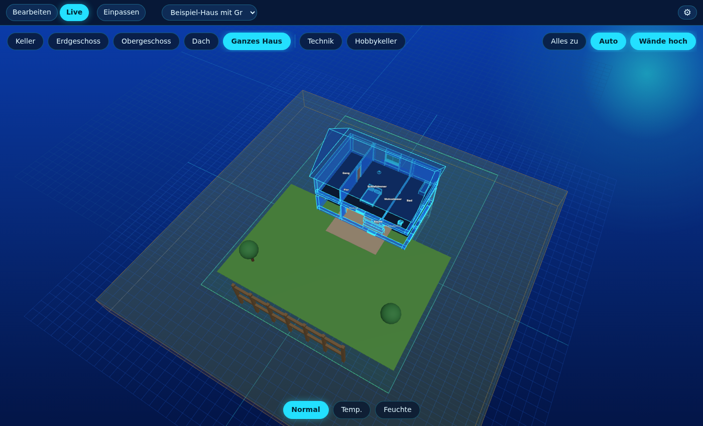
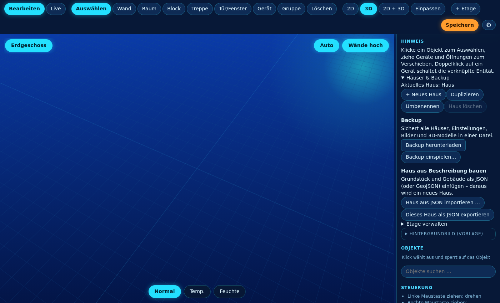
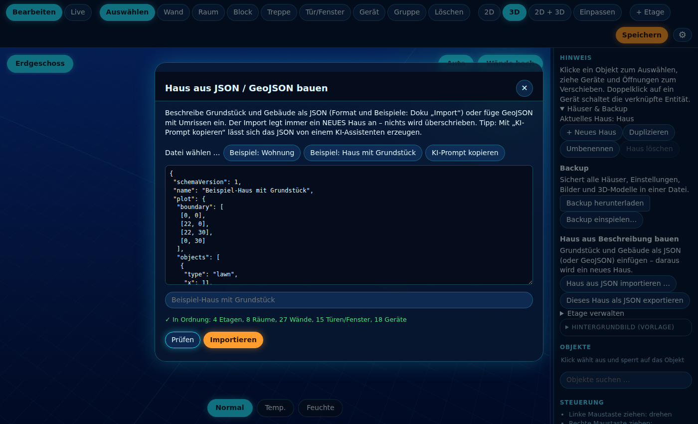
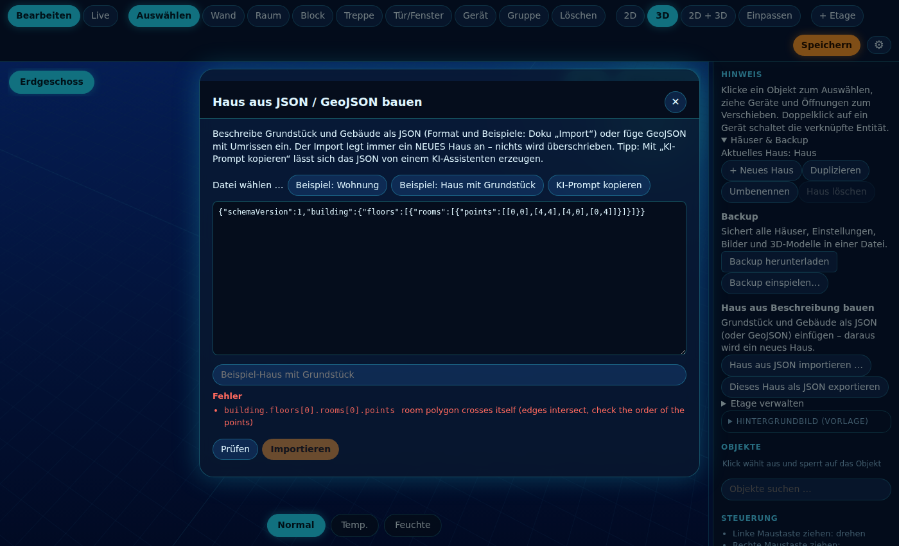
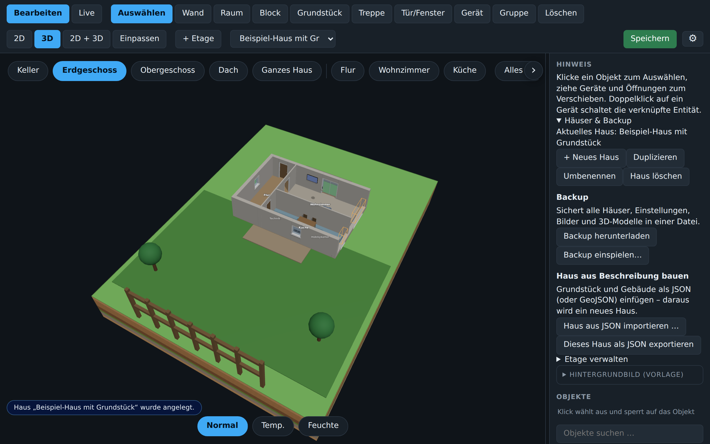
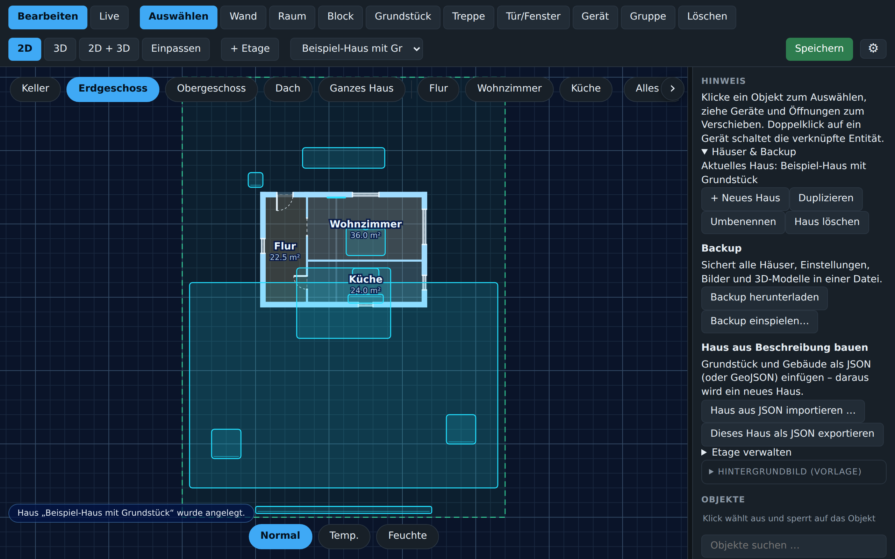

<div align="center">

# 📥 Haus per JSON importieren

**Grundstück, Räume, Fenster, Türen und Geräte beschreiben – das Haus entsteht automatisch.**



</div>


> [!NOTE]
> Der Import legt **immer ein neues Haus** an und überschreibt nie etwas (max. 20 Häuser).

Mit dem Import baust du aus einer kleinen JSON-Beschreibung (Grundstück, Raumpolygone, Fenster, Türen, Geräte) automatisch ein **neues Haus** im 3D Floorplan.

Du kannst die JSON von Hand schreiben, von einer **KI** erzeugen lassen, aus **GeoJSON** (z. B. Katasterdaten/OpenStreetMap) ableiten oder aus einem vorhandenen Haus **exportieren**.

## Inhalt

[Schnellstart](#schnellstart-in-30-sekunden) · [Koordinaten](#koordinaten) · [Format](#format-schemaversion-1) · [API](#api) · [GeoJSON](#geojson) · [KI-Prompting](#ki-prompting) · [Export](#export-round-trip) · [Fehlersuche](#grenzen--fehlersuche)

Fertige Beispiele zum Herunterladen: [`docs/examples/flat.json`](examples/flat.json) (Wohnung, 1 Etage) und [`docs/examples/house.json`](examples/house.json) (Haus mit Grundstück, Keller, EG, OG, Dach).

## Schnellstart in 30 Sekunden

**1. Importdialog öffnen.** Im Bearbeiten-Modus in der Seitenleiste **Häuser & Backup** aufklappen und **Haus aus JSON importieren …** klicken.



**2. Beispiel laden und prüfen.** **Beispiel: Wohnung** oder **Beispiel: Haus mit Grundstück** klicken, dann **Prüfen**. Du bekommst eine Zusammenfassung (Etagen, Räume, Wände, Türen/Fenster, Geräte) und eventuelle Warnungen. **Importieren** wird erst aktiv, wenn genau dieser Text fehlerfrei geprüft wurde.



**3. Fehler lesen.** Bei einem Fehler steht der genaue Pfad in der JSON dabei (hier: ein Raum, dessen Ecken sich überkreuzen). Nichts wird angelegt, solange es Fehler gibt.



**4. Importieren.** Das Haus wird als **neues Haus** angelegt und sofort geöffnet. Dein bisheriges Haus bleibt unverändert; über die Hausauswahl oben wechselst du jederzeit zurück.



**5. Ganzes Haus und Grundstück.** Im Live-Modus zeigt **Ganzes Haus** Gebäude, Dach, Grundstücksgrenze und Gartenobjekte (Rasen, Terrasse, Bäume, Zaun).


**6. Im 2D-Plan weiterarbeiten.** Die Grundstücksgrenze erscheint gestrichelt. Ab jetzt ist alles normal bearbeitbar: Wände verschieben, Geräte mit Entities verknüpfen, Räume ergänzen.



## Koordinaten

- Alles in **Metern**. `x` = nach Osten (rechts), `z` = nach Süden (unten im Grundriss). `[0,0]` ist die obere linke Ecke.
- Polygone: 3–100 Punkte, Reihenfolge egal, **nicht selbstüberschneidend**.
- `building.origin: [x, z]` verschiebt das Gebäude auf dem Grundstück (Grundstücksgrenze und Gartenobjekte bleiben stehen).

## Format (schemaVersion 1)

```jsonc
{
  "schemaVersion": 1,
  "name": "Mein Haus",
  "plot": {                                  // optional: Grundstück
    "boundary": [[0,0],[22,0],[22,30],[0,30]],
    "objects": [{ "type": "tree", "x": 3, "z": 4 }]     // Garten, Terrasse, Pool, Zaun …
  },
  "building": {
    "origin": [5.5, 8],                      // optional
    "wallHeight": 2.6, "outerWall": 0.3, "innerWall": 0.12,
    "footprint": [[0,0],[11,0],[11,9],[0,9]],           // optional: Außenumriss → dicke Außenwände
    "roof": { "type": "gable", "pitch": 38 },           // gable | hip | flat
    "floors": [
      {
        "name": "Erdgeschoss", "kind": "floor",         // floor | basement | roof
        "rooms": [{ "name": "Wohnzimmer", "points": [[0,0],[6,0],[6,5],[0,5]], "area": "wohnzimmer" }],
        "openings": [{ "preset": "doorEntry", "at": [3, 0] }],
        "devices":  [{ "type": "light", "x": 3, "z": 2.5, "entity": "light.wohnzimmer" }]
      }
    ]
  }
}
```

### Wie aus Räumen Wände werden

- Jede Raumkante wird zur Wand. **Gemeinsame Kanten** zweier Räume werden **eine** Innenwand (`innerWall`), Kanten am `footprint` bzw. ohne Nachbarraum werden Außenwände (`outerWall`).
- Stößt eine Wand seitlich an eine andere, wird sie an dieser Stelle geteilt (T-Anschluss).
- Willst du es exakt selbst bestimmen, gib in der Etage `"walls": [...]` an – dann wird nichts abgeleitet.

### Öffnungen (Fenster & Türen)

`{ "preset": "window2", "at": [x, z] }` – die Öffnung rastet an der **nächstgelegenen Wand** ein. Liegt keine Wand in der Nähe, wird sie mit Warnung übersprungen; Überlappungen und Positionen zu nah an Ecken werden korrigiert bzw. gemeldet.


| Preset | Art | Stil | Breite × Höhe | Brüstung |
|---|---|---|---|---|
| `door` | Tür | single | 0.9 × 2.05 m | 0 m |
| `doorEntry` | Tür | single | 1.1 × 2.15 m | 0 m |
| `doorGlass` | Tür | glass | 0.9 × 2.05 m | 0 m |
| `doorDouble` | Tür | double | 1.6 × 2.05 m | 0 m |
| `doorSlide` | Tür | sliding | 1.8 × 2.1 m | 0 m |
| `doorOpen` | Tür | open | 1.0 × 2.05 m | 0 m |
| `window` | Fenster | single | 1.0 × 1.2 m | 0.9 m |
| `window2` | Fenster | double | 1.8 × 1.2 m | 0.9 m |
| `window3` | Fenster | triple | 2.4 × 1.2 m | 0.9 m |
| `windowTall` | Fenster | double | 1.8 × 2.1 m | 0 m |
| `windowBath` | Fenster | single | 0.6 × 0.6 m | 1.5 m |
| `windowFixed` | Fenster | fixed | 1.6 × 1.4 m | 0.6 m |

Überschreibbar: `width`, `height`, `sill`, `style`, `entity` (z. B. Fenstersensor), `name`. Statt `preset` geht auch `"type": "door"|"window"`.

### Geräte & Möbel

`{ "type": "sofa", "x": 2, "z": 3, "y": 0, "rot": 180, "scale": 1, "name": "…", "entity": "light.xyz" }`
Unbekannte Typen werden mit Warnung übersprungen. Alle Typen stehen im Schema (`/api/import/schema`), u. a. Licht (`light`, `spot`, `strip`, `pendant`, `nanoleaf`, `tv_led`), Möbel (`sofa`, `bed`, `kitchen`, …), Sensoren, Garten (`tree`, `lawn`, `pool`, `fence`, `terrace`). Weitere Felder: `ledEntity`, `hideModel`, `panels` (Nanoleaf).

### Etagen

Reihenfolge ist egal: Keller zuerst, Dachgeschoss/Dach zuletzt. Die Dachform steht in `building.roof` (oder in einer Etage mit `"kind": "roof"`). Gartenobjekte aus `plot.objects` landen auf der ersten Nicht-Keller-Etage.

## API

> [!IMPORTANT]
> Alle Aufrufe brauchen Schreibrechte (Home-Assistant-Admin bzw. Editor) und laufen über Ingress oder den direkten Port.

```bash
# nur prüfen, nichts anlegen
curl -X POST "$BASE/api/import?dryRun=1" -H "Content-Type: application/json" -d @house.json
# wirklich anlegen (neues Haus)
curl -X POST "$BASE/api/import?name=Ferienhaus" -H "Content-Type: application/json" -d @house.json
# Haus als Import-JSON exportieren (Round-Trip)
curl "$BASE/api/export/property?house=main" -o mein-haus.json
# JSON-Schema (Editor-Autovervollständigung, KI-Validierung) und Beispiele
curl "$BASE/api/import/schema"
curl "$BASE/api/import/examples/house"
```

Antwort bei Erfolg: `{"ok":true,"id":"…","name":"…","summary":{…},"warnings":[…]}`.
Bei Fehlern HTTP 400 mit `{"errors":[{"path":"building.floors[0].rooms[1].points","message":"…"}],"warnings":[…]}` – der Pfad zeigt genau die Stelle.

### GeoJSON

Ein Polygon, Feature oder eine FeatureCollection in Längen-/Breitengrad wird automatisch erkannt und in lokale Meter umgerechnet. Zuordnung: `properties.role` = `"plot"`/`"building"`, sonst `building`-Tag → Gebäude, `landuse`/`parcel`/`plot` → Grundstück; ohne Angaben ist das größte Polygon das Grundstück. Es entsteht ein Haus mit einem Raum im Umriss des Gebäudes – Räume, Fenster und Möbel ergänzt du im Editor oder per JSON.

## KI-Prompting

Im Import-Dialog gibt es **KI-Prompt kopieren**: Der Prompt enthält das komplette Format, alle erlaubten Typen/Presets und ein Beispiel. Kopiere ihn in ChatGPT/Claude/Gemini und hänge deine Beschreibung an, z. B.:

> Grundstück 20 × 28 m, Haus 10 × 8 m mittig, zwei Etagen. EG: Wohnküche 6×5, Flur, WC, Büro. OG: 3 Zimmer und Bad. Satteldach 35°. Haustür Süden, Terrassentür zum Garten, in jedem Zimmer ein Fenster. Lichter `light.<raum>`.

Tipps:
- Maße nennen (Meter) und sagen, wo Norden/der Eingang ist (Norden = oben = kleines z).
- Räume als **Rechtecke nebeneinander** beschreiben, die sich Kanten teilen – so entstehen saubere Innenwände.
- Das Ergebnis immer erst **Prüfen**; Fehlermeldungen kannst du der KI direkt zurückgeben („Behebe: building.floors[0]… points: …“).
- Entity-IDs nur angeben, wenn du sie kennst – sonst später im Editor zuordnen.
- Grundriss-Foto? Lass die KI die Maße schätzen und frage nach der JSON.

## Export (Round-Trip)

**Dieses Haus als JSON exportieren** (gleiche Seitenleiste) lädt dein aktuelles Haus im Import-Format herunter – mit expliziten Wänden, damit nichts neu abgeleitet wird. Nützlich zum Weitergeben, als Vorlage für die KI („ändere dieses Haus so, dass …“) oder zum Versionieren in Git. Über `GET /api/export/property?house=<id>` auch per Skript.

## Typische Abläufe

| Ziel | Vorgehen |
|---|---|
| Wohnung schnell aufbauen | Beispiel laden, Maße/Räume anpassen, prüfen, importieren |
| Haus von der KI planen lassen | Prompt kopieren, Beschreibung anhängen, Antwort einfügen, prüfen, Fehler an KI zurückgeben |
| Katasterumriss verwenden | GeoJSON einfügen (Gebäude + Grundstück), importieren, Räume im Editor einzeichnen |
| Haus sichern/teilen | Exportieren, Datei weitergeben, beim Empfänger importieren |
| Per Skript/CI | `POST /api/import` mit curl (siehe oben) |

## Fehlermeldungen

| Meldung | Bedeutung | Lösung |
|---|---|---|
| `crosses itself` | Raumkanten überschneiden sich (Bow-Tie) | Punkte im Umlaufsinn angeben |
| `too small or degenerate` | Fläche unter 0,5 m² | Maße prüfen (Meter, nicht cm) |
| `no wall near …` | Öffnung liegt weit von jeder Wand | `at` auf die Wandlinie setzen |
| `overlaps` | Zwei Öffnungen an derselben Stelle | Position oder Breite ändern |
| `unknown device type` | Typ nicht in der Bibliothek | Typ aus dem Schema wählen |
| `schemaVersion` fehlt | Nur Warnung | `"schemaVersion": 1` ergänzen |

## Grenzen & Fehlersuche

- Nur gerade Wände (keine Bögen), Räume als einfache Polygone, max. 100 Punkte; max. 20 Häuser.
- „no wall near …“: Position `at` liegt >~0,5 m von jeder Wand weg → Koordinaten prüfen.
- „overlaps“: zwei Öffnungen an derselben Stelle.
- Im Demo-HTML ist der Import nicht verfügbar (kein Backend).
